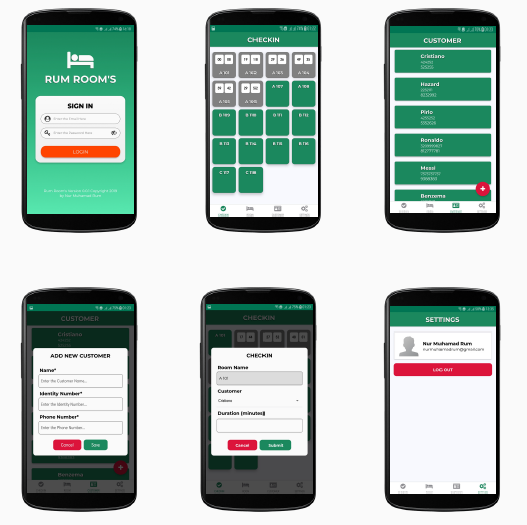

# Room's Room (Room Management)

Rum's Room is a Room Management Application specifically lodging or hotel where to simplify the Checkin & Checkout process to be more effective & efficient, with various features such as Countdown Time, Add Room & Edit Room, Add Customer & Edit Customer and Upload Photos for Admin.

## Table of Contents

- [Getting Started](#getting-started)
  - [Prerequisites](#prerequisites)
  - [Installation](#installation)
  - [Setup](#setup)
- [Screenshots](#screenshots)
- [Built With](#built-with)
- [Author](#author)

## Getting Started

Before starting to install the project, there're some things that need to be done first.

### Prerequisites

Make sure all of these are properly installed in your system.

| Application  | Download                                                                            |
| ------------ | ----------------------------------------------------------------------------------- |
| Git          | [Windows](https://gitforwindows.org/) / [Linux](https://git-scm.com/download/linux) |
| Node.js      | [Link](https://nodejs.org/en/download/)                                             |
| React Native | [Link](https://facebook.github.io/react-native/docs/getting-started)                |
| MySQL        | [Link](https://www.mysql.com/downloads/)                                            |

### Installation

First, clone this repository into your system.

```
git clone https://github.com/nurmuhamadrum/rums-room-management.git
```

Then, install all the packages that described in `package.json`.

```
npm install
```

### Setup

For the client setup, if you are using physical device to run the app, make sure your ADB drivers already installed or you can use Android Emulator from AVD (Android Virtual Device) Manager of Android Studio (_This part should be done while installing the React Native framework_)

Then, install and run the application.

For IOS :

`npm run ios`

And for Android :

`npm run android`

Wait till the application is installed and run into your device. Now, you can explore Room's Room Application and its features. Enjoy!

## Screenshots



## Built With

- [React Native](https://facebook.github.io/react-native/) - Front-end
- [Express JS](https://expressjs.com) - Back-end
- [MySQL](https://www.mysql.com) - Database

## Author

**Nur Muhamad Rum** - [https://github.com/nurmuhamadrum](https://github.com/nurmuhamadrum)
